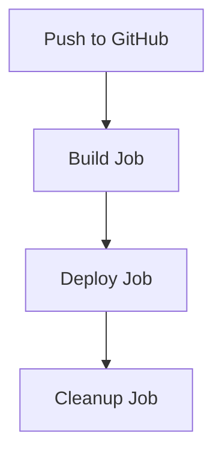

# Cenitex Cloud Hosting Web Application

## Overview

Cenitex Cloud Hosting is a web application designed to effortlessly manage privileged user access, embodying our commitment to security-focused tech solutions. This application runs on Azure Web App and leverages various Azure services to ensure seamless deployment and operation.

## Features

- Dynamic user interface with responsive design.
- Secure user authentication and data fetching.
- Real-time data rendering and updates.
- Automated deployment and CI/CD pipeline using GitHub Actions.
- Integration with Azure Logic Apps for automated email notifications.

## Architecture

The application is built using the following technologies:

| Component  | Technology          |
|------------|---------------------|
| **Frontend** | HTML, CSS, JavaScript |
| **Backend**  | FastAPI, Python    |
| **Database** | Azure SQL Database |
| **Deployment** | Azure Web App    |
| **CI/CD**    | GitHub Actions     |

## Workflow

### CI/CD Pipeline

The CI/CD pipeline is defined using GitHub Actions and consists of the following jobs:

1. **Build**:
    - Checkout the repository.
    - Set up the Python environment.
    - Install dependencies.
    - Lint the code using `flake8`.
    - Upload artifacts for deployment.
2. **Deploy**:
    - Log in to Azure.
    - Configure Azure Web App settings.
    - Deploy the application to Azure Web App.
3. **Cleanup**:
    - Delete artifacts after deployment.

### Workflow Diagram


# Getting Started

## Prerequisites
- Azure account with necessary permissions.
- GitHub account.
- Python 3.8 or higher
- [pip](https://pip.pypa.io/en/stable/installing/) (Python package installer)
- [uvicorn](https://www.uvicorn.org/) (ASGI server)
- [dotenv](https://pypi.org/project/python-dotenv/) (For loading environment variables)
- [openpyxl](https://pypi.org/project/openpyxl/) (For working with Excel files)
- [pandas](https://pandas.pydata.org/) (For data manipulation and analysis)
- [aiohttp](https://docs.aiohttp.org/en/stable/) (For making asynchronous HTTP requests)
- [fastapi](https://fastapi.tiangolo.com/) (For building APIs with Python)

## Installation

1. Clone the repository:
    ```bash
    git clone https://github.com/your-repo/cenitex-cloud-hosting.git
    cd cenitex-cloud-hosting
    ```

2. Set up the Python environment:
    ```bash
    python -m venv venv
    source venv/bin/activate
    ```

3. Install dependencies:
    ```bash
    pip install -r requirements.txt
    ```

## Running the Application

1. Start the FastAPI server:
    ```bash
    uvicorn app:app --reload
    ```

2. Access the application:
    Open your browser and navigate to [http://localhost:8000](http://localhost:8000).

## Deployment

The application is deployed using GitHub Actions. Ensure that the following secrets are set in your GitHub repository:

- `AZURE_CLIENT_ID`
- `AZURE_TENANT_ID`
- `AZURE_SUBSCRIPTION_ID`
- `AZURE_RESOURCE_GROUP_NAME`
- `AZURE_RESOURCE_NAME`
- `AZURE_RESOURCE_DNS_NAME`
- `AZURE_WEBAPPS_PUBLISH_PROFILE`
